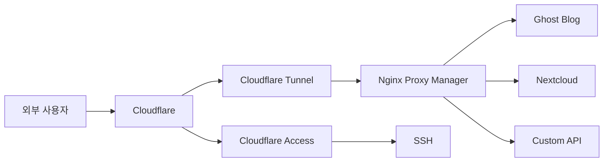
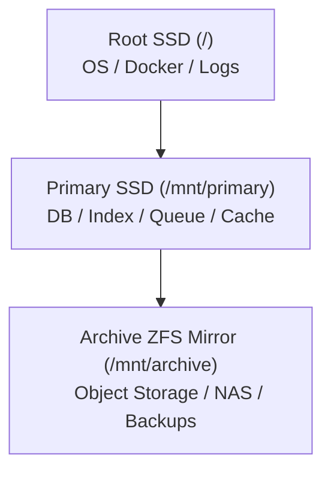
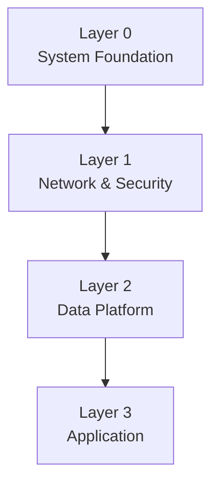

# serengeti-iac

Ubuntu 24.04 LTS 기반 홈랩 인프라를 코드와 문서로 관리하기 위한 저장소입니다.  
이 프로젝트의 핵심 목적은 `집 안의 단일 서버`를 안전하고 반복 가능하게 구성하고, 시간이 지나도 같은 방식으로 다시 구축할 수 있도록 설계와 실행 자산을 한곳에 모으는 것입니다.

현재 이 저장소는 완성된 IaC 구현체라기보다, 다음 두 가지를 동시에 담고 있습니다.

1. 사람이 읽을 수 있는 상세 설계 문서
2. 운영자 로컬 개발 환경을 빠르게 맞추기 위한 `user_cli` 부트스트랩 자산

즉, 이 저장소는 "바로 배포 가능한 완성본"만을 담는 곳이 아니라, 홈랩을 어떤 방식으로 운영할지에 대한 기준 문서이자 구현의 출발점입니다.

보안상 실제 서버 IP, 포트, 도메인, 토큰, 키 이름, 비밀번호 등 운영값은 문서에 직접 적지 않고 모두 `<...>` 형태의 플레이스홀더로 마스킹했습니다.

---

## 한눈에 보기

### 이 프로젝트가 해결하려는 문제

- 건물 메인 라우터를 제어할 수 없는 환경에서 홈서버를 안정적으로 외부에 공개해야 합니다.
- 서버 한 대에 블로그, NAS, 데이터베이스, 캐시, 오브젝트 스토리지, 백업까지 함께 운영해야 합니다.
- 디스크 성격이 다르므로 읽기 중심, 쓰기 중심, 장기 보관용 스토리지를 분리해야 합니다.
- 수동 설정에 의존하지 않고, 나중에 다시 보더라도 재현 가능한 문서와 스크립트가 필요합니다.

### 이 저장소가 지향하는 결과

- 네트워크, 보안, 스토리지, 애플리케이션 구조를 문서로 명확히 남긴다.
- Docker 기반 계층형 구조로 운영 서비스를 분리한다.
- 민감 정보는 `.env` 등으로 분리하고, Git에는 남기지 않는다.
- 운영자 개인 Ubuntu CLI 환경까지 같은 저장소 안에서 정리한다.

---

## 왜 이 저장소가 필요한가

홈랩 프로젝트는 처음 만들 때보다 시간이 지난 뒤가 더 어렵습니다.  
어떤 포트를 왜 열었는지, 어떤 디스크에 어떤 데이터를 저장했는지, 왜 Cloudflare Tunnel을 썼는지, 왜 ZFS mirror를 선택했는지 같은 맥락이 사라지면 재구축이 매우 비싸집니다.

이 저장소는 그 문제를 줄이기 위해 만들어졌습니다.

- 사람에게는 설계 의도와 운영 원칙을 설명하는 문서 역할을 합니다.
- 에이전트나 자동화 도구에게는 구현 기준이 되는 소스 역할을 합니다.
- 미래의 본인에게는 "왜 이렇게 설계했는가"를 복기할 수 있는 운영 매뉴얼 역할을 합니다.

---

## 대상 환경

| 항목 | 값 |
|---|---|
| 운영체제 | Ubuntu Server 24.04 LTS |
| 서버 IP | `<server_private_ip>` |
| 설치 위치 | 우영하우스 403호 |
| 도메인 | `<public_domain>` |
| 외부 노출 방식 | Cloudflare Tunnel |
| 핵심 철학 | 인바운드 포트 직접 개방 없이 서비스 공개 |

---

## 네트워크 구조

이 프로젝트는 일반적인 "집 공유기 포트포워딩" 방식과 다릅니다.  
가장 중요한 제약은 `건물 메인 라우터에 접근할 수 없다는 점`입니다.

### 물리 네트워크 토폴로지

```text
Internet
  ↓
건물 Main Router
  └─ <building_router_ip>
      ↓
403호 IDF / L2 Switch
  ├─ Ubuntu Server
  │   └─ <server_private_ip>
  └─ H724G Router
      ├─ WAN: <room_router_wan_ip>
      └─ LAN: <room_router_lan_ip>
           └─ WiFi Devices (<wifi_subnet>)
```

### 서비스 공개 전략



이 구조를 선택한 이유는 명확합니다.

- 건물 라우터 포트포워딩이 불가능합니다.
- 서버는 Cloudflare 쪽으로 아웃바운드 연결만 열면 됩니다.
- 외부에서 직접 서버 인바운드 포트를 두드리지 않으므로 공격면을 줄일 수 있습니다.
- 웹 서비스와 SSH 접근 정책을 Cloudflare 계층에서 분리해 제어할 수 있습니다.

---

## 스토리지 설계

이 프로젝트는 디스크를 하나의 큰 볼륨처럼 쓰지 않습니다.  
데이터 성격에 맞춰 세 개의 계층으로 나눕니다.

### 디스크 역할 분담

| 디스크 | 용량 | 역할 | 주요 데이터 |
|---|---:|---|---|
| SSD #1 | 500GB | OS Root | Ubuntu, Docker 엔진, 시스템 로그 |
| SSD #2 | 1TB | Primary Storage | PostgreSQL, Neo4j, Elasticsearch, Kafka, Redis |
| HDD x2 | 8TB + 8TB | Archive Storage | Minio, Nextcloud, Borg 저장소, 장기 보관 데이터 |

### 스토리지 개념도



### 왜 이렇게 나누는가

- 운영체제와 애플리케이션 데이터의 장애 영역을 분리하기 쉽습니다.
- 쓰기 부하가 큰 데이터는 1TB SSD에 몰아 성능과 내구성을 확보합니다.
- 장기 보관 데이터는 ZFS mirror 위에 둬서 스냅샷과 복구 안정성을 확보합니다.
- NAS와 백업 저장소가 서비스 데이터와 독립적으로 관리됩니다.

---

## 목표 아키텍처

프로젝트는 3계층으로 나뉩니다.

### 계층 구조



### Layer 0: System Foundation

서버 자체를 안정적으로 운영하기 위한 기초 계층입니다.

- Ubuntu 초기 설정
- ZFS 아카이브 스토리지 구성
- Primary SSD 마운트
- SSH 보안 설정
- UFW 방화벽 정책
- Cloudflare Tunnel 설치

### Layer 1: Network & Security

외부 접근과 내부 라우팅을 담당하는 계층입니다.

- Nginx Proxy Manager
- Cloudflare Tunnel
- 로컬 SSH 접근 정책
- Docker 네트워크 분리

### Layer 2: Data Platform

애플리케이션이 의존하는 공통 데이터 서비스를 모은 계층입니다.

- PostgreSQL
- Neo4j
- Elasticsearch
- Redis
- Kafka (KRaft)
- Minio

### Layer 3: Application

실제 사용자가 접하는 서비스 계층입니다.

- Ghost 블로그
- Nextcloud NAS
- Custom API
- 정기 백업 파이프라인

---

## Docker 네트워크 설계

서비스를 아무 네트워크에나 섞지 않고, 목적별로 네트워크를 분리합니다.

```text
proxy-tier
├─ Nginx Proxy Manager
├─ Ghost
├─ Nextcloud
└─ Custom API

data-tier
├─ PostgreSQL
├─ Neo4j
├─ Elasticsearch
├─ Redis
├─ Kafka
└─ Minio
```

### 설계 의도

- `proxy-tier`는 외부 요청을 받아야 하는 서비스만 붙입니다.
- `data-tier`는 내부 데이터 서비스만 두어 직접 노출을 피합니다.
- 애플리케이션은 필요할 때만 두 네트워크를 함께 사용합니다.
- 프록시와 데이터 계층을 분리해 실수로 DB를 외부에 노출할 가능성을 줄입니다.

---

## 현재 저장소 상태

현재는 설계 문서만 있는 상태를 지나, `AGENTS.md`의 구조를 따라가는 1차 IaC 스캐폴딩이 이미 들어간 상태입니다.

### 현재 실제로 저장소에 들어 있는 것

```text
serengeti-iac/
├── .env.example
├── Makefile
├── AGENTS.md
├── README.md
├── system/
├── docker/
└── user_cli/
    ├── init_ubuntu.sh
    ├── .zshrc
    └── .tmux.conf.local
```

### 현재 각 파일의 역할

- `.env.example`
  - 실제 배포 전 복사해서 사용하는 환경 변수 템플릿입니다.
  - 비밀번호, 토큰, 디스크 ID, 포트 등은 모두 플레이스홀더 상태로 들어 있습니다.
- `Makefile`
  - 시스템 설정, Docker 네트워크 생성, 계층별 compose 실행을 묶는 진입점입니다.
- `AGENTS.md`
  - 홈랩의 전체 설계 문서입니다.
  - 목표 디렉토리 구조, 계층별 서비스, 스토리지/네트워크 전략이 자세히 정리돼 있습니다.
- `README.md`
  - 사람이 빠르게 프로젝트를 이해하기 위한 소개 문서입니다.
  - 현재 상태와 목표 상태를 연결해 설명합니다.
- `system/`
  - 호스트 OS 기준의 기초 설정 스크립트와 SSH/UFW/Cloudflare Tunnel 설정 템플릿이 들어 있습니다.
- `docker/`
  - `proxy-tier`, `data-tier`, 블로그, Nextcloud, 백업까지 포함한 Docker Compose 정의가 들어 있습니다.
- `user_cli/init_ubuntu.sh`
  - 운영자 로컬 Ubuntu 환경을 셋업하는 스크립트입니다.
- `user_cli/.zshrc`
  - `oh-my-zsh`, `starship`, 각종 플러그인을 반영한 쉘 설정입니다.
- `user_cli/.tmux.conf.local`
  - `gpakosz/.tmux` 기반의 tmux 로컬 오버라이드 설정입니다.

### 아직 남아 있는 작업

구조 자체는 들어왔지만, 아직 다음 단계가 남아 있습니다.

- 실제 운영값을 채운 `.env`
- 실서버에서의 실행 검증
- 애플리케이션 초기 DB 생성 및 프록시 호스트 연결
- 백업/복구 실제 테스트
- 서비스별 운영 문서 보강

즉, 지금 이 저장소는 "문서만 있는 상태"는 아니지만, 아직 실운영 검증 전의 초기 구현 단계라고 보는 것이 맞습니다.

---

## `user_cli`는 무엇인가

`user_cli/`는 홈랩 서버를 직접 배포하는 코드가 아닙니다.  
대신 운영자가 사용하는 Ubuntu 워크스테이션 또는 노트북의 CLI 환경을 빠르게 맞추기 위한 도구 모음입니다.

### `init_ubuntu.sh`가 하는 일

- 기본 패키지 설치
  - `vim`, `curl`, `wget`, `git`, `tmux`, `zsh`, `nodejs`, `npm`, `gh` 등
- Python CLI 도구 설치 기반 준비
  - `uv` 설치
  - `uv tool install nvitop`
- AWS CLI v2 설치
- `oh-my-zsh` 설치
- `zsh-autosuggestions`, `zsh-syntax-highlighting` 설치
- `starship` 프롬프트 설치
- tmux 설정 적용
- Git 사용자 정보 및 별칭 설정

### 왜 별도 디렉토리로 분리했는가

- 서버 IaC와 개인 개발 환경 부트스트랩은 목적이 다릅니다.
- 서버 구성 변경과 개인 쉘 설정 변경을 같은 레벨에서 다루면 혼란이 생깁니다.
- 에이전트나 사람이 저장소를 읽을 때 `이건 서버용인가, 내 로컬용인가`를 바로 구분할 수 있어야 합니다.

### 실행할 때 주의할 점

이 스크립트는 현재 디렉토리의 설정 파일을 읽어 복사합니다.  
따라서 저장소 루트가 아니라 `user_cli/` 안으로 들어가서 실행해야 합니다.

```bash
cd user_cli
bash ./init_ubuntu.sh
```

실행 후에는 다시 로그인하거나 `zsh`를 실행해 기본 쉘 변경을 반영하는 것이 좋습니다.

---

## 목표 디렉토리 구조

장기적으로는 아래 구조를 목표로 합니다.

```text
serengeti-iac/
├── Makefile
├── .env
├── .env.example
├── .gitignore
├── README.md
├── AGENTS.md
├── system/
│   ├── 01_setup.sh
│   ├── 02_zfs_archive.sh
│   ├── 03_mount_primary.sh
│   ├── sshd_config
│   ├── ufw.sh
│   └── cloudflared_install.sh
├── user_cli/
│   ├── init_ubuntu.sh
│   ├── .zshrc
│   └── .tmux.conf.local
└── docker/
    ├── networks.sh
    ├── layer1-ops/
    ├── layer2-data/
    └── layer3-apps/
```

### 이 구조가 좋은 이유

- `system/`은 호스트 설정만 담당합니다.
- `docker/`는 컨테이너 기반 서비스 정의만 담당합니다.
- `user_cli/`는 운영자 개인 환경을 별도로 관리합니다.
- 문서와 스크립트의 책임 범위가 비교적 선명하게 나뉩니다.

---

## 사람이 이 저장소를 읽는 순서

처음 보는 사람이면 아래 순서로 읽는 것이 가장 효율적입니다.

1. 이 `README.md`를 읽고 프로젝트의 큰 그림을 파악합니다.
2. [AGENTS.md](/home/girinman/workspace/serengeti-iac/AGENTS.md)를 읽고 상세 설계를 확인합니다.
3. 실제 구현 파일인 `system/`, `docker/`, `Makefile`, `.env.example`을 확인합니다.
4. 운영자 로컬 환경이 필요하면 `user_cli/`를 사용합니다.

---

## 이 프로젝트의 운영 원칙

- 민감 정보는 절대 Git에 직접 커밋하지 않습니다.
- 서버 보안은 "외부 인바운드 최소화"를 기본 원칙으로 둡니다.
- 데이터는 접근 패턴에 따라 스토리지를 분리합니다.
- 문서가 코드보다 먼저 방향을 잡고, 코드는 그 문서를 따라갑니다.
- 로컬 개발 환경과 서버 프로비저닝은 분리해 관리합니다.

---

## 앞으로 채워질 구현 항목

현재 기준으로 보면, 다음이 구현 우선순위가 됩니다.

1. `.env` 실값 작성 및 호스트별 값 확정
2. Ubuntu 서버에서 Layer 0 스크립트 실제 실행 검증
3. Docker 데이터 서비스와 애플리케이션의 실제 기동 검증
4. Nginx Proxy Manager 및 Cloudflare Tunnel 연동 검증
5. 백업 파이프라인 및 복구 절차 실전 테스트

---

## 참고 문서

- 상세 설계 문서: [AGENTS.md](/home/girinman/workspace/serengeti-iac/AGENTS.md)
- 로컬 CLI 부트스트랩 스크립트: [user_cli/init_ubuntu.sh](/home/girinman/workspace/serengeti-iac/user_cli/init_ubuntu.sh)
- 쉘 설정: [user_cli/.zshrc](/home/girinman/workspace/serengeti-iac/user_cli/.zshrc)
- tmux 설정: [user_cli/.tmux.conf.local](/home/girinman/workspace/serengeti-iac/user_cli/.tmux.conf.local)
