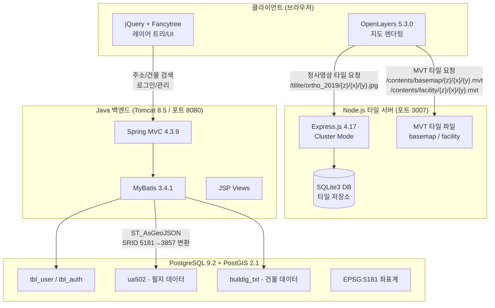
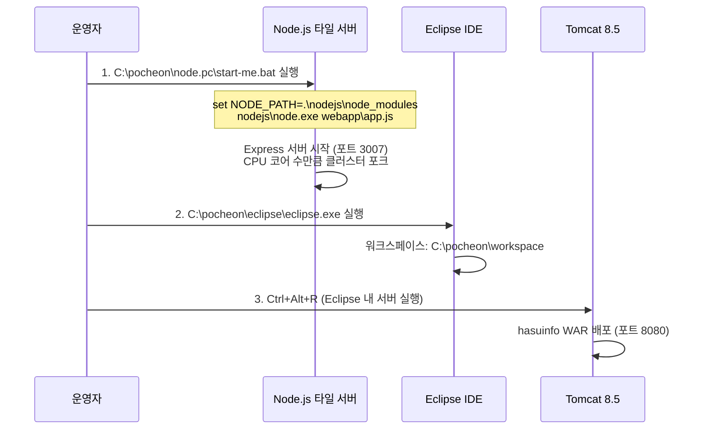

# Step 1: 기존 시스템 복원 및 아키텍처/의존성 파악

## 1. AS-IS 분석 요약

### 시스템 개요
**포천시 하수도 정보 관리 시스템 (hasuinfo)**
지하 하수시설물(맨홀, 관로 등)을 지도 위에 시각화하고, 주소/건물 검색 기능과 사용자/관리자 기능을 제공하는 GIS 기반 웹 서비스.

### 구조적 문제점 진단
1. **이중 서버 구조의 비효율**: Node.js 타일 서버(포트 3007)와 Java/Tomcat 백엔드(포트 8080)가 독립적으로 운영되며 통합 관리 도구 없음
2. **타일 데이터 하드코딩**: `app.js`에 연도별 레이어가 수동으로 하나씩 등록되어 있음 (ortho_2019~2030, facility_2019~2027, bgmap_2019~2027)
3. **지역 종속 Extent**: `index.html`에 포천시 전용 좌표가 하드코딩 (`extent: [14144546, 4541736, 14206280, 4605288]`, `center: [14162116, 4568592]`)
4. **프론트엔드-백엔드 뒤섞임**: `mainPage.jsp`에 지도 렌더링 로직, 스타일 함수, UI 이벤트가 혼합
5. **레거시 라이브러리**: Spring 4.3.9, Java 1.8, PostgreSQL 9.2, OpenLayers 5.3.0 등 오래된 스택
6. **보안 취약**: CORS 전체 허용(`*`), 하드코딩된 DB 크리덴셜, BCrypt 외 추가 보안 메커니즘 없음

---

## 2. 시스템 아키텍처

### 2.1 전체 구성



### 2.2 서버 기동 순서



---

## 3. 기술 스택 및 의존성 목록

### 3.1 프론트엔드
| 구성요소 | 버전 | 역할 |
|---------|------|------|
| OpenLayers | 5.3.0 | 지도 렌더링 (MVT, XYZ 타일) |
| jQuery | 3.4.1 | DOM 조작, AJAX |
| Fancytree | 2.34 | 레이어 트리 컨트롤 |

### 3.2 Node.js 타일 서버 (포트 3007)
| 구성요소 | 버전 | 역할 |
|---------|------|------|
| Node.js | (포함된 바이너리) | 런타임 |
| Express.js | 4.17.1 | HTTP 서버 |
| sqlite3 | 4.1.0 | 타일 데이터 조회 |
| http-proxy | 1.18.0 | 프록시 리디렉션 |
| ejs | 2.7.1 | 템플릿 (미사용 추정) |
| request | 2.88.0 | HTTP 클라이언트 (MAPPIPE) |

### 3.3 Java 백엔드 (Tomcat 8080)
| 구성요소 | 버전 | 역할 |
|---------|------|------|
| Java JDK | 1.8 (컴파일: 1.6) | 런타임 |
| Spring MVC | 4.3.9.RELEASE | 웹 프레임워크 |
| Spring Security | 4.2.1.RELEASE | BCrypt 암호화 |
| MyBatis | 3.4.1 | SQL 매핑 |
| PostgreSQL JDBC | 9.0-801.jdbc4 | DB 드라이버 |
| Jackson | 2.5.1 | JSON 직렬화 |
| Apache Tomcat | 8.5.46 | WAS |
| Servlet API | 2.5 | 서블릿 |
| JSP API | 2.1 | 뷰 렌더링 |
| JSTL | 1.2 | JSP 태그 라이브러리 |

### 3.4 데이터베이스
| 구성요소 | 버전 | 역할 |
|---------|------|------|
| PostgreSQL | 9.2.13 | RDBMS |
| PostGIS | 2.1.5 | 공간 데이터 확장 |

---

## 4. 진입점 및 핵심 모듈 역할

### 4.1 Node.js 타일 서버 진입점
**파일**: `origin/pocheon/node.pc/webapp/app.js`

| 엔드포인트 | 역할 |
|-----------|------|
| `GET /tilite/:layer/:level/:col/:row.:ext` | SQLite3에서 타일 데이터 조회 (정사영상 .jpg/.png, 3D 메시 .wgl) |
| `GET /QUERY/LAYERS` | 등록된 레이어 목록 반환 |
| `GET /MAPPIPE/*` | 외부 URL 프록시 리디렉션 |
| `GET /contents/*` | 정적 파일 서빙 (MVT, 이미지, 비디오) |
| `GET /` | index.html 서빙 (독립 뷰어) |

**타일 저장 구조**:
- `contents/basemap/{z}/{x}/{y}.mvt` - 배경 지도 벡터 타일 (329MB, 줌 10~18)
- `contents/facility/{z}/{x}/{y}.mvt` - 시설물 벡터 타일 (37MB, 줌 10~15)
- `contents/tile.ortho.2019.sqlite` - 정사영상 래스터 타일 (SQLite)

### 4.2 Java 백엔드 진입점
**파일**: `origin/pocheon/workspace/hasuinfo/`

| 모듈 (Controller) | URL 패턴 | 역할 |
|-------------------|---------|------|
| `HomeController` | `/` | 로그인 페이지로 리디렉트 |
| `UserController` | `/user/*` | 로그인, 회원가입, 로그아웃, ID 중복확인 |
| `MainController` | `/main/*` | 메인 지도 페이지 서빙 |
| `SearchController` | `/search/*` | 읍면동/리 목록, 지번/건물명 검색 (GeoJSON 반환) |
| `AdminController` | `/admin/*` | 사용자 관리 (CRUD, 권한 설정) |
| `MenuController` | `/menu/*` | 도움말 페이지 |

### 4.3 핵심 DB 테이블

| 테이블 | 용도 | 비고 |
|--------|------|------|
| `tbl_user` | 사용자 정보 | userid, userpw(BCrypt), auth(0/1/5) |
| `tbl_auth` | 권한 코드 | 0:임시, 1:일반, 5:관리자 |
| `ua502` | 필지(토지) 데이터 | emd, ri, jibun, geom(EPSG:5181) |
| `buildig_txt` | 건물 데이터 | bldnm, pnu, geom(EPSG:5181) |
| `spatial_ref_sys` | 좌표계 정의 | EPSG:5181 수동 삽입 필요 |

---

## 5. 실행 환경 구성 가이드

### 5.1 필수 소프트웨어 설치

```
1. PostgreSQL 9.2.13 (x64) + PostGIS 2.1.5
   - 설치 파일: origin/pocheon/install/1.PostgreSQL/, 2.PostGIS/

2. JDK 8 (1.8)
   - 설치 파일: origin/pocheon/install/3.JDK설치/jdk-8u77-windows-x64.exe

3. Eclipse IDE (포함됨)
   - 경로: origin/pocheon/eclipse/eclipse.exe

4. Apache Tomcat 8.5.46 (포함됨)
   - 경로: origin/pocheon/apache-tomcat-8.5.46/

5. Node.js (포함됨)
   - 경로: origin/pocheon/node.pc/nodejs/node.exe
```

### 5.2 데이터베이스 설정

```sql
-- 1. PostgreSQL 설치 후 postgis 데이터베이스 생성
CREATE DATABASE postgis;

-- 2. PostGIS 확장 활성화
CREATE EXTENSION postgis;

-- 3. EPSG:5181 좌표계 등록
INSERT INTO spatial_ref_sys (srid, auth_name, auth_srid, proj4text, srtext)
VALUES (5181, 'EPSG', 5181,
  '+proj=tmerc +lat_0=38 +lon_0=127 +k=1 +x_0=200000 +y_0=500000 +ellps=GRS80 +towgs84=0,0,0,0,0,0,0 +units=m +no_defs',
  'PROJCS["Korea 2000 / Central Belt", ...]');

-- 4. 사용자/권한 테이블 생성
CREATE TABLE tbl_user(
  userid VARCHAR(200) PRIMARY KEY NOT NULL,
  userpw VARCHAR(500) NOT NULL,
  usernm VARCHAR(200) NOT NULL,
  email VARCHAR(200) NOT NULL,
  auth VARCHAR(3) NOT NULL,
  insertdate VARCHAR(30),
  updatedate VARCHAR(30),
  authdate VARCHAR(30)
);

CREATE TABLE tbl_auth(
  authnum VARCHAR(20) PRIMARY KEY,
  authname VARCHAR(100)
);

INSERT INTO tbl_auth VALUES ('0','임시사용자');
INSERT INTO tbl_auth VALUES ('1','일반사용자');
INSERT INTO tbl_auth VALUES ('5','관리자');

-- 5. 공간 데이터 임포트 (shp2pgsql 사용)
-- shp2pgsql -s 5181 origin/pocheon/data/upload_shp/ua502.shp ua502 | psql -d postgis
-- shp2pgsql -s 5181 origin/pocheon/data/upload_shp/buildig_txt.shp buildig_txt | psql -d postgis
```

### 5.3 JDBC 접속 정보

**파일**: `hasuinfo/src/main/resources/jdbc.properties`
```properties
jdbc.driverClassName=org.postgresql.Driver
jdbc.url=jdbc:postgresql://localhost:5432/postgis
jdbc.username=postgres
jdbc.password=postgis
```

### 5.4 pg_hba.conf 설정

```
host  all  all  127.0.0.1/32  md5
host  all  all  ::1/128       md5
host  all  all  0.0.0.0/0     md5   # 외부 접근 허용
```

### 5.5 서버 기동 절차

```
Step 1: PostgreSQL 서비스 시작 (Windows 서비스로 자동 시작)

Step 2: Node.js 타일 서버 시작
  > C:\pocheon\node.pc\start-me.bat
  - Express 서버가 포트 3007에서 클러스터 모드로 실행

Step 3: Eclipse에서 Tomcat 서버 실행
  > C:\pocheon\eclipse\eclipse.exe
  - 워크스페이스: C:\pocheon\workspace
  - Ctrl+Alt+R로 서버 실행 (포트 8080)

접속: http://localhost:8080/hasuinfo/
관리자: admin / 1111
```

### 5.6 Tomcat 설정

**서버 포트**: `origin/pocheon/apache-tomcat-8.5.46/conf/server.xml`
- HTTP: 8080
- AJP: 8009
- Shutdown: 8005

---

## 6. 핵심 개선 대상 리스트 (Action Items)

| 우선순위 | 대상 | 현재 문제 | 개선 방향 |
|---------|------|----------|----------|
| P0 | `app.js` 레이어 등록 | 30개 이상 레이어를 수동 하드코딩 | 파일시스템/DB 스캔 기반 자동 레이어 등록 |
| P0 | `index.html` / `mainPage.jsp` Extent | 포천시 좌표 하드코딩 | 설정 파일 또는 API 기반 동적 Extent |
| P1 | `mainPage.jsp` | 600줄+ JSP에 모든 로직 혼합 | 프론트엔드 분리 (React/Vue + REST API) |
| P1 | `jdbc.properties` | 평문 크리덴셜 | 환경변수 또는 시크릿 매니저 활용 |
| P1 | Spring 4.x / Java 8 | EOL 스택 | Spring Boot 3.x / Java 17+ 마이그레이션 |
| P2 | PostgreSQL 9.2 | EOL 버전 | PostgreSQL 16 (serengeti-iac 활용) |
| P2 | 타일 생성 파이프라인 | 수동 생성된 정적 타일 | PostGIS + pg_tileserv 또는 Martin 등 동적 타일 서버 |
| P2 | SQLite 타일 저장소 | 단일 파일 DB, 확장 불가 | MBTiles 표준 또는 PostGIS 기반 타일 캐시 |

---

## 7. 디렉토리 구조 전체 맵

```
origin/
├── movem/OneDrive/바탕 화면/
│   ├── 서버시스템재부팅.txt          # 기동 절차 메모
│   ├── pg_hba.conf                  # PostgreSQL 인증 설정
│   ├── start-me.bat - 바로 가기.lnk # Node 서버 바로가기
│   └── eclipse.exe - 바로 가기.lnk  # Eclipse 바로가기
│
├── pocheon/
│   ├── node.pc/                     # Node.js 타일 서버
│   │   ├── start-me.bat             # 서버 시작 스크립트
│   │   ├── nodejs/                  # Node.js 바이너리 + 모듈
│   │   └── webapp/
│   │       ├── app.js               # Express 메인 서버 (포트 3007)
│   │       ├── index.html           # OpenLayers 독립 뷰어
│   │       ├── layer_symbol.json    # 레이어 심볼 정의 (230KB)
│   │       └── contents/
│   │           ├── basemap/{z}/{x}/{y}.mvt  # 배경 MVT (329MB)
│   │           ├── facility/{z}/{x}/{y}.mvt # 시설물 MVT (37MB)
│   │           └── tile.ortho.2019.sqlite   # 정사영상 SQLite
│   │
│   ├── workspace/
│   │   ├── hasuinfo/                # Java 메인 프로젝트
│   │   │   ├── pom.xml              # Maven 빌드 (Spring 4.3.9)
│   │   │   └── src/main/
│   │   │       ├── java/org/spring/woo/
│   │   │       │   ├── HomeController.java
│   │   │       │   ├── user/        # 사용자 모듈 (Controller/Service/DAO/VO)
│   │   │       │   ├── admin/       # 관리자 모듈
│   │   │       │   ├── search/      # 검색 모듈 (PostGIS GeoJSON)
│   │   │       │   ├── main/        # 메인 페이지 모듈
│   │   │       │   └── menu/        # 메뉴/도움말 모듈
│   │   │       ├── resources/
│   │   │       │   ├── jdbc.properties      # DB 접속 정보
│   │   │       │   ├── mybatis-config.xml    # MyBatis 설정
│   │   │       │   └── mappers/
│   │   │       │       ├── loginMapper.xml   # 로그인 SQL
│   │   │       │       ├── adminMapper.xml   # 관리자 SQL
│   │   │       │       └── searchMapper.xml  # 검색 SQL (ST_AsGeoJSON)
│   │   │       └── webapp/WEB-INF/
│   │   │           ├── web.xml
│   │   │           ├── spring/
│   │   │           │   ├── root-context.xml     # DataSource, MyBatis
│   │   │           │   ├── spring-security.xml  # BCrypt Bean
│   │   │           │   └── appServlet/
│   │   │           │       └── servlet-context.xml  # MVC 설정
│   │   │           └── views/
│   │   │               ├── main/mainPage.jsp    # 메인 지도 (핵심!)
│   │   │               ├── user/*.jsp           # 로그인/가입
│   │   │               ├── admin/*.jsp          # 관리자 UI
│   │   │               └── menu/help.jsp        # 도움말
│   │   └── bak/                     # 이전 백업 버전들
│   │
│   ├── data/
│   │   ├── upload_shp/              # Shapefile 원본 (124MB)
│   │   │   ├── ua502.shp/dbf/shx   # 필지 데이터
│   │   │   ├── ua502_point.shp      # 필지 포인트
│   │   │   └── buildig_txt.shp      # 건물 텍스트
│   │   └── hasuinfo_20200224최종배포.zip
│   │
│   ├── apache-tomcat-8.5.46/        # Tomcat WAS
│   ├── eclipse/                     # Eclipse IDE
│   ├── install/                     # 설치 파일
│   │   ├── 1.PostgreSQL/            # PostgreSQL 9.2.13 설치파일
│   │   ├── 2.PostGIS/               # PostGIS 2.1.5 설치파일
│   │   └── 3.JDK설치/              # JDK 7/8 설치파일
│   └── SQL.txt                      # DB 스키마/초기 데이터 SQL
│
└── C_drive/pocheon/workspace/       # Eclipse 메타데이터 백업
    └── .metadata/
```
