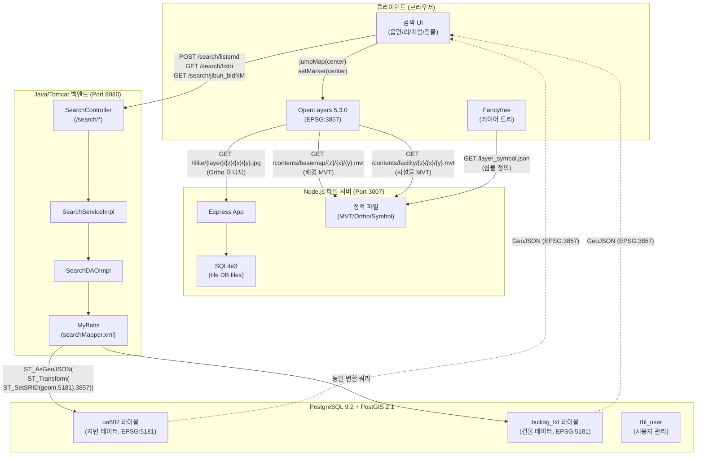
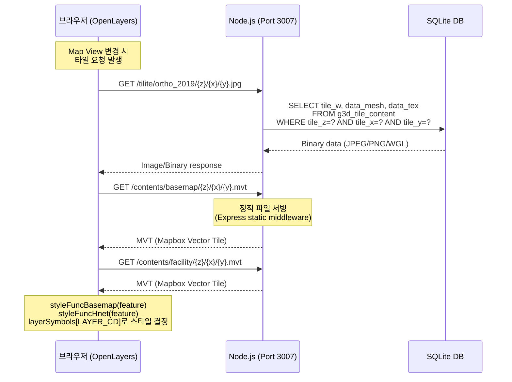
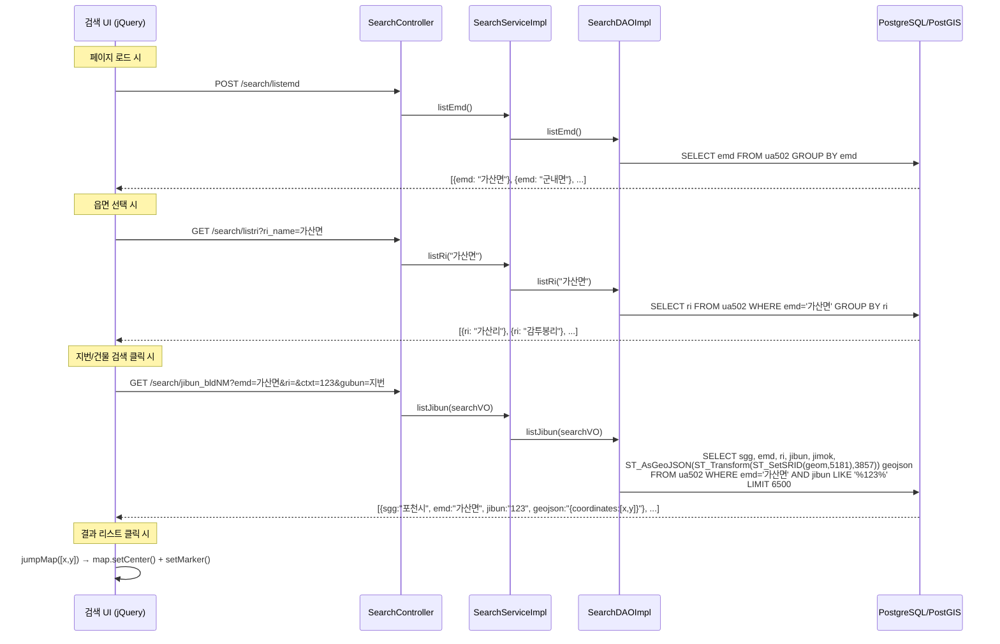
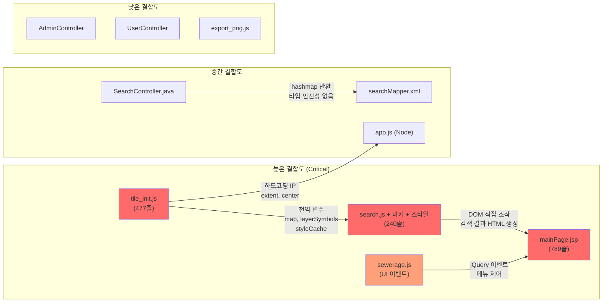
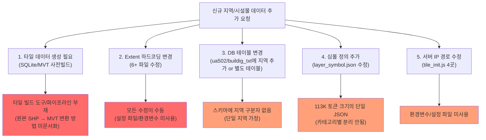
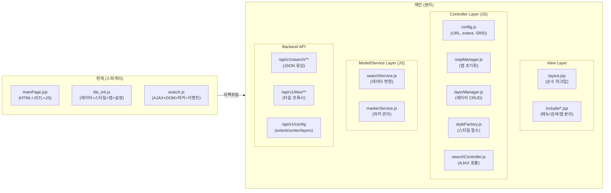

# Step 2-3: 공간 데이터 흐름 및 하드코딩/결합도 분석

## 1. AS-IS 분석 요약

현재 시스템의 공간 데이터 흐름은 **두 가지 독립 파이프라인**으로 구성되어 있다:

1. **타일 파이프라인** (Node.js → SQLite → MVT/Ortho 이미지): 사전 빌드된 벡터/래스터 타일을 제공
2. **검색 파이프라인** (Spring MVC → MyBatis → PostGIS → GeoJSON): 지번/건물 검색 시 실시간 공간 쿼리

두 파이프라인 모두 **포천시 전용으로 하드코딩**되어 있으며, 새로운 지역/데이터를 추가하려면 코드 전반에 걸친 수정이 불가피하다.

### 핵심 구조적 문제

| 문제 | 설명 |
|------|------|
| **좌표계 이중 구조** | DB: EPSG:5181 (Korea 2000) → 프론트엔드: EPSG:3857 (Web Mercator). 변환은 SQL 레벨에서만 수행 |
| **지역 종속 Extent** | 포천시 Bounding Box `[14144546, 4541736, 14206280, 4605288]`가 최소 6곳에 하드코딩 |
| **서버 IP 하드코딩** | `121.131.133.216:3007`이 프론트엔드 JS에 직접 박힘 |
| **테이블명 하드코딩** | `ua502`, `buildig_txt` 테이블이 MyBatis XML에 고정 |
| **비즈니스/뷰 미분리** | 검색 로직, GeoJSON 파싱, 마커 표시, DOM 조작이 단일 JS 파일에 혼재 |

---

## 2. 데이터 흐름도

### 2.1 전체 시스템 데이터 흐름



### 2.2 타일 데이터 흐름 상세



### 2.3 검색 데이터 흐름 상세



---

## 3. 하드코딩 및 결합도 전수 조사

### 3.1 하드코딩된 포천시 Bounding Box / Center (EPSG:3857)

| 값 | 파일 | 라인 | 용도 |
|----|------|------|------|
| `extent: [14144546, 4541736, 14206280, 4605288]` | `node.pc/webapp/index.html` | 436 | layerBasemap extent |
| `extent: [14144546, 4541736, 14206280, 4605288]` | `node.pc/webapp/index.html` | 455 | layerFacility extent |
| `center: [14162116, 4568592]` | `node.pc/webapp/index.html` | 480 | Map View center |
| `extent: [14144546, 4541736, 14206280, 4605288]` | `node.pc/webapp/index.html` | 481 | Map View extent |
| `extent: [14144546, 4541736, 14206280, 4605288]` | `hasuinfo/.../tile_init.js` | 419 | layerBasemap extent |
| `extent: [14144546, 4541736, 14206280, 4605288]` | `hasuinfo/.../tile_init.js` | 439 | layerFacility extent |
| `center: [14162116, 4568592]` | `hasuinfo/.../tile_init.js` | 465 | Map View center |
| `extent: [14144546, 4541736, 14206280, 4605288]` | `hasuinfo/.../tile_init.js` | 466 | Map View extent |

**영향**: 다른 지역의 데이터를 로드해도 맵이 포천시 영역으로 고정되어 있어 이동/확인 불가

### 3.2 하드코딩된 서버 IP/포트

| 값 | 파일 | 라인 | 용도 |
|----|------|------|------|
| `http://121.131.133.216:3007` | `hasuinfo/.../tile_init.js` | 83 | layer_symbol.json 로드 |
| `http://121.131.133.216:3007` | `hasuinfo/.../tile_init.js` | 397 | Ortho 타일 URL |
| `http://121.131.133.216:3007` | `hasuinfo/.../tile_init.js` | 426 | Basemap MVT URL |
| `http://121.131.133.216:3007` | `hasuinfo/.../tile_init.js` | 444 | Facility MVT URL |

**영향**: 서버 이전 시 JS 파일 직접 수정 필요. 환경별(dev/staging/prod) 분기 불가

### 3.3 하드코딩된 좌표계 SRID

| 값 | 파일 | 라인 | 용도 |
|----|------|------|------|
| `ST_SetSRID(geom, 5181)` | `searchMapper.xml` | 23 | 지번 검색 좌표 변환 |
| `ST_SetSRID(geom, 5181)` | `searchMapper.xml` | 41 | 건물 검색 좌표 변환 |

**영향**: 다른 좌표계의 데이터가 들어오면 쿼리 수정 필요. SRID가 SQL에 직접 박혀있어 동적 변경 불가

### 3.4 하드코딩된 테이블명

| 값 | 파일 | 라인 | 용도 |
|----|------|------|------|
| `ua502` | `searchMapper.xml` | 10, 16, 24 | 지번(필지) 데이터 테이블 |
| `buildig_txt` | `searchMapper.xml` | 42 | 건물 데이터 테이블 |
| `tbl_user` | `loginMapper.xml` | 19-21, 27 | 사용자 테이블 |
| `tbl_auth` | `adminMapper.xml` | 28 | 권한 테이블 |

**영향**: 신규 지역 추가 시 동일 스키마의 별도 테이블을 만들거나 기존 테이블에 지역 구분 컬럼을 추가해야 함

### 3.5 하드코딩된 포천시 문자열

| 값 | 파일 | 라인 | 용도 |
|----|------|------|------|
| `포천시 하수도 관리` | `mainPage.jsp` | 7 | 페이지 title |
| `포천시 하수도 관리` | `loginForm.jsp` | 6 | 로그인 title |
| `포천시 하수도 관리` | `idInsertForm.jsp` | 6 | 회원가입 title |
| `포천시 하수도 관리` | `help.jsp` | 6 | 도움말 title |
| `포천시 하수도 관리` | `userRead.jsp` | 6 | 사용자정보 title |
| `포천시 하수도 관리` | `userList.jsp` | 8 | 사용자목록 title |
| `포천시청`, `경기도 포천시...` | `mainPage.jsp` | 594-627 | 검색 예시 (HTML 주석 내) |

### 3.6 하드코딩된 타일 레이어 정의 (app.js)

| 값 | 파일 | 라인 | 용도 |
|----|------|------|------|
| `ortho_2019`~`ortho_2030` | `app.js` | 91-102 | 정사영상 타일 레이어 (연도별) |
| `facility_2019`~`facility_2027` | `app.js` | 106-114 | 시설물 MVT 레이어 (연도별) |
| `bgmap_2019`~`bgmap_2027` | `app.js` | 118-126 | 배경 MVT 레이어 (연도별) |

**영향**: 새 연도 데이터 추가 시 `app.js`에 직접 레이어 항목을 추가해야 함. 동적 레이어 조회 메커니즘 부재

### 3.7 하드코딩된 레이어 카테고리 (tile_init.js / index.html)

| 값 | 파일 | 라인 | 용도 |
|----|------|------|------|
| `"정사영상", "하수시설", "하수관로", "장기계획관로", "경계", "지형지물"` | `tile_init.js` | 49-57 | Fancytree 레이어 그룹명 |
| `"하수시설/맨홀"` | `tile_init.js` | 57 | 맨홀 하위 그룹 |

**영향**: 상수도, 가스관 등 신규 시설물 유형 추가 시 JS 코드 직접 수정 필요

---

## 4. 결합도 분석

### 4.1 스파게티 코드 심각도 맵



### 4.2 핵심 결합도 문제 상세

#### 문제 1: `tile_init.js` - 모든 것이 한 파일에

이 단일 파일(477줄)에 다음이 모두 포함:
- **레이어 심볼 로딩** (XHR로 layer_symbol.json fetch)
- **Fancytree 트리 구성** (DOM 조작)
- **2개의 Style Function** (`styleFuncHnet`, `styleFuncBasemap` - 각각 ~100줄)
- **4개의 OpenLayers 레이어 생성** (Ortho, Debug, Basemap, Facility)
- **Map 인스턴스 생성** (extent, center 하드코딩)
- **하드코딩된 서버 IP** 4곳

#### 문제 2: `search.js` - 검색/마커/스타일이 혼재

이 파일(240줄)에 다음이 뒤섞여 있음:
- **AJAX 검색 호출** (listemd, listri, jibun_bldNM)
- **검색 결과 HTML 문자열 생성** (`feature.append("<div class='list_box'...")`)
- **GeoJSON 파싱** (`data.result[k].geojson = JSON.parse(...)`)
- **지도 이동** (`jumpMap` → `map.getView().setCenter()`)
- **마커 생성** (`setMarker` → `featureOverlay.getSource().addFeature()`)
- **마커 스타일 함수** (`styleFunction`)
- **마커 상호작용** (pointermove, click 이벤트)

**XSS 취약점**: `searchlist_box_jibun()`, `searchlist_box_building()` 함수에서 서버 응답 데이터를 `feature.append()`로 직접 HTML에 삽입. 데이터에 악성 스크립트가 있으면 실행됨.

#### 문제 3: `mainPage.jsp` - 뷰와 설정의 결합

789줄의 거대 JSP에 포함된 내용:
- HTML 마크업 (메뉴, 사이드바, 맵 영역, 툴바, 검색폼)
- JSTL 조건부 렌더링 (`<c:if test="${login.auth ne 0}">`)
- PC/태블릿 메뉴 중복 (동일 기능이 두 번 정의)
- 인라인 JavaScript (이벤트 핸들러)

#### 문제 4: Spring 백엔드 - 타입 안전성 부재

```
SearchController → SearchService → SearchDAO → MyBatis
       ↓                ↓              ↓
   Map<String,Object>   Map         Map (hashmap)
```

모든 레이어에서 `Map<String, Object>`를 사용하여 타입 안전성이 전무. VO 클래스(`SearchVO`)는 입력 파라미터용으로만 사용되고, 결과는 비정형 Map으로 반환.

#### 문제 5: `app.js` (Node.js) - 하드코딩된 레이어 사전(Dictionary)

레이어 정의가 코드에 직접 하드코딩 (91-126줄, 총 36개 레이어). 새 연도/새 지역 데이터 추가 시:
- `dicLayers` 객체에 수동으로 항목 추가
- SQLite 파일명 규칙(`tile.{type}.{year}.sqlite`)이 암묵적
- 레이어 메타데이터(범위, 최대줌 등)를 코드에서 관리하지 않음

---

## 5. 병목 지점 식별

### 5.1 새 데이터 추가가 어려운 기술적 원인



### 5.2 병목 우선순위 (데이터 확장 관점)

| 순위 | 병목 | 난이도 | 영향 범위 |
|------|------|--------|-----------|
| 1 | **타일 빌드 파이프라인 부재** - SHP→MVT/SQLite 변환 프로세스가 문서화/자동화되지 않음 | 높음 | 전체 |
| 2 | **Extent 하드코딩** - 6+ 파일에 포천시 좌표가 박혀있어 다른 지역 조회 불가 | 낮음 | 프론트엔드 |
| 3 | **서버 IP 하드코딩** - 환경별 배포 불가 | 낮음 | 프론트엔드 |
| 4 | **테이블명/SRID 하드코딩** - 다중 지역 데이터 수용 구조 부재 | 중간 | 백엔드 |
| 5 | **레이어 사전 하드코딩** - Node.js에서 연도별 레이어 수동 관리 | 중간 | 타일 서버 |
| 6 | **layer_symbol.json 단일 파일** - 수백 개 심볼이 113K 토큰 크기 JSON 하나에 집중 | 낮음 | 프론트엔드 |

---

## 6. 핵심 개선 대상 리스트 (Action Items)

### 즉시 개선 가능 (Quick Win)

| # | 대상 | 현재 | 개선 방향 |
|---|------|------|-----------|
| 1 | **서버 URL** | JS에 `121.131.133.216:3007` 하드코딩 | 환경변수 또는 `config.js` 분리 |
| 2 | **Extent/Center** | JS에 포천시 좌표 하드코딩 | API 또는 설정에서 동적 로드 |
| 3 | **SRID** | SQL에 `5181` 하드코딩 | 테이블 메타데이터 또는 `geometry_columns`에서 조회 |
| 4 | **페이지 title** | JSP에 "포천시" 하드코딩 | Spring message resource 또는 설정 프로퍼티 |

### 구조적 분리 필요 (Refactoring)

| # | 대상 | 현재 | 개선 방향 |
|---|------|------|-----------|
| 5 | **tile_init.js** | 단일 파일에 레이어/스타일/맵 전부 | `config.js` + `layerManager.js` + `styleFactory.js` + `mapInit.js` 분리 |
| 6 | **search.js** | 검색/DOM/마커/이벤트 혼재 | `searchService.js` + `searchView.js` + `markerManager.js` 분리 |
| 7 | **mainPage.jsp** | 789줄 거대 JSP | 레이아웃 + 메뉴 + 맵 영역 + 검색 패널 JSP include로 분리 |
| 8 | **Spring 백엔드** | `Map<String,Object>` 반환 | 타입 안전한 DTO/ResponseVO 도입 |
| 9 | **app.js 레이어** | 36개 레이어 수동 등록 | 파일시스템 스캔 또는 설정 파일에서 동적 로드 |

### MVC/API 분리 제안



### API 기반 구조 전환 시 핵심 엔드포인트

| 엔드포인트 | 현재 | 제안 |
|------------|------|------|
| 지도 설정 | JS 하드코딩 | `GET /api/v1/config` → `{center, extent, srid, tileServerUrl}` |
| 읍면 목록 | `POST /search/listemd` | `GET /api/v1/regions/{regionId}/districts` |
| 리 목록 | `GET /search/listri` | `GET /api/v1/regions/{regionId}/districts/{emd}/villages` |
| 지번 검색 | `GET /search/jibun_bldNM?gubun=지번` | `GET /api/v1/search/parcels?emd=...&ri=...&q=...` |
| 건물 검색 | `GET /search/jibun_bldNM?gubun=건물명` | `GET /api/v1/search/buildings?emd=...&ri=...&q=...` |
| 레이어 목록 | Node.js `/QUERY/LAYERS` | `GET /api/v1/layers` (메타데이터+심볼 포함) |
| 타일 제공 | `GET /tilite/{layer}/{z}/{x}/{y}` | `GET /api/v1/tiles/{layer}/{z}/{x}/{y}` |

---

## 7. 데이터베이스 스키마 분석

### 현재 확인된 테이블 구조

#### `ua502` (지번/필지 데이터)
```
| 컬럼    | 타입     | 설명                    |
|---------|----------|------------------------|
| sgg     | text     | 시군구 (포천시)          |
| emd     | text     | 읍면동                  |
| ri      | text     | 리                      |
| jibun   | text     | 지번                    |
| jimok   | text     | 지목                    |
| geom    | geometry | 공간 데이터 (EPSG:5181) |
```

#### `buildig_txt` (건물 데이터)
```
| 컬럼    | 타입     | 설명                    |
|---------|----------|------------------------|
| pnu     | text     | 필지고유번호            |
| sgg     | text     | 시군구                  |
| emd     | text     | 읍면동                  |
| ri      | text     | 리                      |
| jibun   | text     | 지번                    |
| jimok   | text     | 지목                    |
| bldnm   | text     | 건물명                  |
| geom    | geometry | 공간 데이터 (EPSG:5181) |
```

#### MVT 타일 내 Feature 속성 (facility)
```
| 속성      | 설명                    |
|-----------|------------------------|
| LAYER_CD  | 레이어 코드 (N*, F*, P*) |
| SYM_KEY   | 심볼 키                 |
| SYM_ANG   | 심볼 각도 (도)          |
| FSN       | 시설번호                |
| LEVEL     | 레벨                    |
| KW_YMD    | 설치년도                |
| KW_MA     | 관재질                  |
| KW_DI     | 관경                    |
| KW_LENG   | 연장                    |
| KW_HI_1   | 시점관저고              |
| KW_HI_2   | 종점관저고              |
| KW_SL     | 구배                    |
```

### LAYER_CD 접두사 규칙

| 접두사 | 분류 | 지오메트리 타입 | 최소 줌 레벨 |
|--------|------|----------------|-------------|
| `N` | 맨홀 (Node) | Point | 18 |
| `F` | 시설물 (Facility) | Point | 15 |
| `P` | 관로 (Pipe) | LineString | 15 |
| `BASE_*` | 배경지도 | 다양함 | - |
