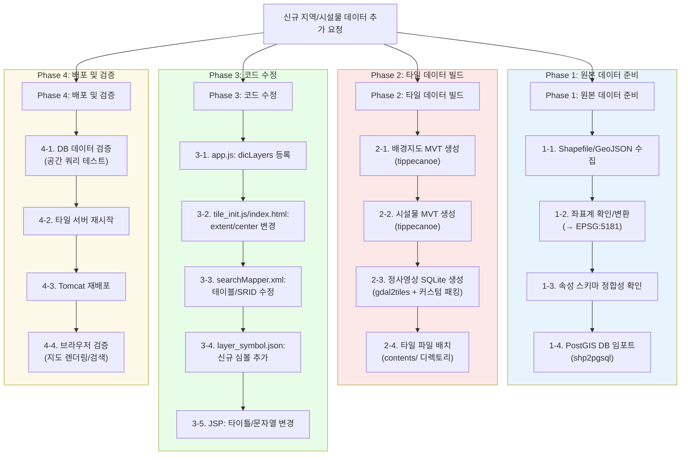
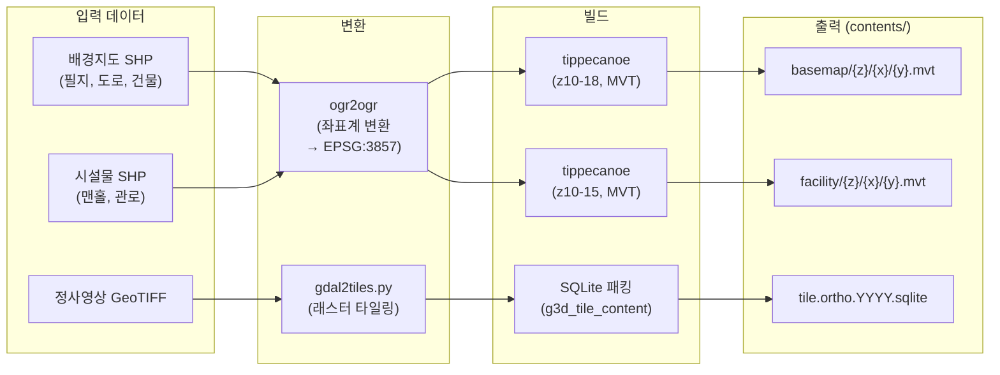
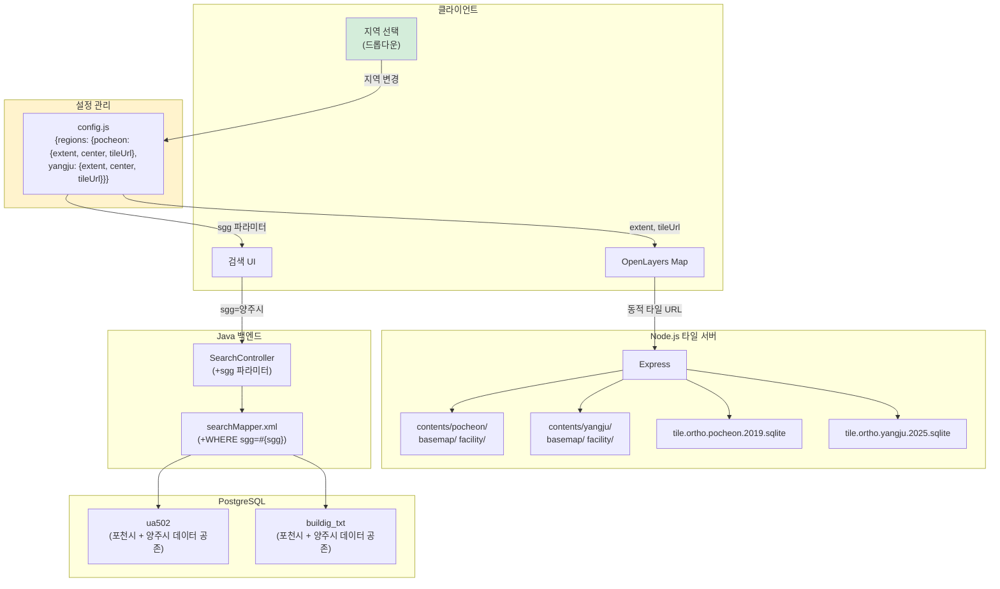

# Step 4: 기존 구조 기반의 데이터 확장 가이드 (Legacy Expansion Process)

## 1. AS-IS 분석 요약

### 현재 데이터 추가 프로세스의 구조적 문제

현재 시스템에는 **문서화된 데이터 임포트 파이프라인이 존재하지 않는다**. 코드베이스 전체를 검색한 결과 tippecanoe, ogr2ogr, shp2pgsql, GDAL 등의 자동화 스크립트나 빌드 도구가 일체 발견되지 않았다. 이는 데이터 준비가 외부 도구(데스크탑 GIS 소프트웨어 등)를 통해 수동으로 이루어졌음을 의미한다.

| 문제 | 설명 |
|------|------|
| **타일 빌드 파이프라인 부재** | SHP→MVT/SQLite 변환 방법이 코드에 없음. 외부에서 사전 생성된 타일을 수동 배치 |
| **지역 종속 하드코딩** | Extent, Center, 서버 IP가 6+ 파일에 하드코딩. 새 지역 추가 시 전수 수정 필요 |
| **단일 지역 가정 스키마** | DB 테이블(ua502, buildig_txt)에 지역 구분자가 없음. `sgg` 컬럼이 존재하나 쿼리에서 필터링하지 않음 |
| **레이어 수동 등록** | Node.js app.js에 36개 레이어를 수동으로 하드코딩 (dicLayers) |
| **심볼 단일 파일** | layer_symbol.json (100+개 심볼)이 하나의 JSON에 집중. 신규 시설물 유형 추가 시 수동 편집 |

---

## 2. 데이터 추가 전체 프로세스 개요

### 2.1 End-to-End 데이터 추가 흐름도



---

## 3. Phase 1: 원본 데이터 준비

### 3.1 필요한 데이터 포맷 및 요구사항

현재 시스템이 수용 가능한 공간 데이터는 크게 **3가지 용도**로 구분된다:

| 용도 | 현재 포맷 | 필요 좌표계 | DB 대상 | 비고 |
|------|-----------|------------|---------|------|
| **필지(토지) 데이터** | Shapefile (Polygon) | EPSG:5181 | `ua502` 테이블 | 지번 검색용 |
| **건물 데이터** | Shapefile (Point/Polygon) | EPSG:5181 | `buildig_txt` 테이블 | 건물명 검색용 |
| **시설물 데이터** (하수관로, 맨홀 등) | Shapefile/GeoJSON → MVT | EPSG:3857 | MVT 타일 파일 | 지도 시각화용 |

### 3.2 데이터 소스 확인

현재 `origin/pocheon/data/upload_shp/`에 보관된 원본 Shapefile:

| 파일 | 크기 | 타입 | 용도 |
|------|------|------|------|
| `ua502.shp/.dbf/.shx` | ~93 MB | Polygon | 필지 경계 |
| `ua502_point.shp/.dbf/.shx` | ~28 MB | Point | 필지 중심점 |
| `buildig_txt.shp/.dbf/.shx` | ~3 MB | Point | 건물 텍스트 라벨 |

### 3.3 신규 지역 데이터 수집 가이드

대한민국 공간 데이터 수집 시 활용 가능한 소스:

| 데이터 유형 | 소스 | 포맷 | 좌표계 |
|-------------|------|------|--------|
| 필지(연속지적도) | 국가공간정보포털 (data.nsdi.go.kr) | SHP | EPSG:5174/5179/5181 |
| 건물 | 국가공간정보포털 / 브이월드 | SHP/GeoJSON | EPSG:5174/5179/5181 |
| 정사영상 | 국토지리정보원 / 브이월드 | GeoTIFF/ECW | EPSG:5186/3857 |
| 하수시설물 | 지자체 하수도 관리대장 | SHP/DXF/CAD | 다양함 (측량 원본) |
| 행정경계 | 통계청 통계지리정보서비스 | SHP/GeoJSON | EPSG:5179 |

### 3.4 좌표계 변환

수집한 데이터의 좌표계가 EPSG:5181이 아닌 경우 변환이 필요하다:

```bash
# 좌표계 확인
ogrinfo -so input.shp layer_name | grep "Layer SRS"

# EPSG:5179 → EPSG:5181 변환 (필지/건물 - PostGIS 임포트용)
ogr2ogr -s_srs EPSG:5179 -t_srs EPSG:5181 output_5181.shp input_5179.shp

# EPSG:5181 → EPSG:3857 변환 (시설물 - MVT 타일 빌드용)
ogr2ogr -s_srs EPSG:5181 -t_srs EPSG:3857 output_3857.shp input_5181.shp

# GeoJSON 변환 (tippecanoe 입력용)
ogr2ogr -f GeoJSON -t_srs EPSG:3857 output.geojson input.shp
```

### 3.5 속성 스키마 정합성

#### ua502 (필지) 테이블 스키마

신규 데이터가 다음 컬럼을 포함해야 한다:

```
| 컬럼    | 타입     | 필수 | 설명                    | 매핑 예시 (연속지적도)      |
|---------|----------|------|------------------------|---------------------------|
| sgg     | text     | O    | 시군구명                | 예: "양주시"               |
| emd     | text     | O    | 읍면동명                | 예: "광적면"               |
| ri      | text     |      | 리명                    | 예: "광석리"               |
| jibun   | text     | O    | 지번                    | 예: "123-4"               |
| jimok   | text     |      | 지목                    | 예: "대"                   |
| geom    | geometry | O    | EPSG:5181 Polygon/Point | SHP의 geometry 컬럼        |
```

#### buildig_txt (건물) 테이블 스키마

```
| 컬럼    | 타입     | 필수 | 설명                    | 매핑 예시                  |
|---------|----------|------|------------------------|---------------------------|
| pnu     | text     |      | 필지고유번호            | 예: "4183011000100010000"  |
| sgg     | text     | O    | 시군구명                | 예: "양주시"               |
| emd     | text     | O    | 읍면동명                | 예: "광적면"               |
| ri      | text     |      | 리명                    | 예: "광석리"               |
| jibun   | text     |      | 지번                    | 예: "123-4"               |
| jimok   | text     |      | 지목                    | 예: "대"                   |
| bldnm   | text     | O    | 건물명                  | 예: "광적면사무소"          |
| geom    | geometry | O    | EPSG:5181 Point/Polygon | SHP의 geometry 컬럼        |
```

#### MVT 시설물 Feature 속성 스키마

MVT 타일 내 시설물 데이터는 다음 속성을 포함해야 한다:

```
| 속성      | 타입   | 필수 | 설명              | 스타일 매핑               |
|-----------|--------|------|-------------------|--------------------------|
| LAYER_CD  | string | O    | 레이어 코드        | N*=맨홀, F*=시설물, P*=관로 |
| SYM_KEY   | string | O    | 심볼 키            | layer_symbol.json 키와 1:1 |
| SYM_ANG   | number |      | 심볼 각도 (도)     | 회전 렌더링에 사용          |
| FSN       | string |      | 시설번호           | 팝업 표시용               |
| LEVEL     | number |      | 레벨              | -                        |
| KW_YMD    | string |      | 설치년도           | 팝업 표시용               |
| KW_MA     | string |      | 관재질             | 팝업 표시용               |
| KW_DI     | string |      | 관경 (mm)          | 팝업 표시용               |
| KW_LENG   | number |      | 연장 (m)           | 팝업 표시용               |
| KW_HI_1   | number |      | 시점관저고          | 팝업 표시용               |
| KW_HI_2   | number |      | 종점관저고          | 팝업 표시용               |
| KW_SL     | number |      | 구배              | 팝업 표시용               |
```

### 3.6 PostGIS 데이터 임포트

```bash
# 1. 필지 데이터 임포트 (ua502 테이블에 추가)
shp2pgsql -s 5181 -a new_region_parcel.shp ua502 | psql -d postgis -U postgres

# 옵션 설명:
#   -s 5181  : 소스 SRID 지정
#   -a       : 기존 테이블에 APPEND (기존 데이터 유지)
#   -c       : CREATE (테이블 새로 생성, 기존 데이터 삭제)

# 2. 건물 데이터 임포트 (buildig_txt 테이블에 추가)
shp2pgsql -s 5181 -a new_region_building.shp buildig_txt | psql -d postgis -U postgres

# 3. 공간 인덱스 재생성 (성능)
psql -d postgis -U postgres -c "REINDEX INDEX ua502_geom_idx;"
psql -d postgis -U postgres -c "REINDEX INDEX buildig_txt_geom_idx;"

# 4. 임포트 검증
psql -d postgis -U postgres -c "
  SELECT sgg, COUNT(*) as cnt
  FROM ua502
  GROUP BY sgg
  ORDER BY sgg;
"
```

> **주의**: `shp2pgsql -a` (append) 모드를 사용하면 기존 포천시 데이터를 유지하면서 신규 지역 데이터를 추가할 수 있다. 다만, 현재 `searchMapper.xml`의 쿼리가 `sgg` 컬럼으로 필터링하지 않으므로, 여러 지역의 데이터가 섞여 검색 결과에 나타날 수 있다 (Phase 3에서 수정 필요).

---

## 4. Phase 2: 타일 데이터 빌드

### 4.1 현재 타일 파일 구조

```
contents/
├── basemap/                    # 배경지도 MVT (329 MB)
│   ├── 10/{x}/{y}.mvt         # 줌 10 (최저)
│   ├── 11/ ... 17/
│   └── 18/{x}/{y}.mvt         # 줌 18 (최고)
├── facility/                   # 시설물 MVT (37 MB)
│   ├── 10/{x}/{y}.mvt
│   └── 15/{x}/{y}.mvt         # 줌 15 (최고)
└── tile.ortho.2019.sqlite      # 정사영상 (39 GB)
```

### 4.2 배경지도 MVT 타일 생성

배경지도(필지 경계, 도로, 건물 윤곽 등)를 MVT 타일로 변환한다. 원본 도구는 확인 불가하나, [tippecanoe](https://github.com/felt/tippecanoe)를 사용한 재현이 가능하다.

```bash
# 1. Shapefile → GeoJSON 변환 (tippecanoe 입력 포맷)
ogr2ogr -f GeoJSON -t_srs EPSG:3857 basemap.geojson input_basemap.shp

# 2. tippecanoe로 MVT 타일 디렉토리 생성
tippecanoe \
  --output-to-directory=contents/basemap/ \
  --minimum-zoom=10 \
  --maximum-zoom=18 \
  --no-tile-compression \
  --force \
  basemap.geojson

# 주요 옵션:
#   --output-to-directory : {z}/{x}/{y}.mvt 디렉토리 구조 생성
#   --minimum-zoom=10     : 현재 시스템의 minZoom과 일치
#   --maximum-zoom=18     : 현재 시스템의 maxZoom과 일치
#   --no-tile-compression : 현재 시스템이 비압축 MVT를 기대 (gzip 미사용)
#   --force               : 기존 디렉토리 덮어쓰기
```

### 4.3 시설물 MVT 타일 생성

시설물 데이터(맨홀, 관로 등)는 `LAYER_CD`, `SYM_KEY` 등의 속성이 포함되어야 한다.

```bash
# 1. 시설물 Shapefile → GeoJSON (속성 유지)
ogr2ogr -f GeoJSON -t_srs EPSG:3857 facility.geojson input_facility.shp

# 2. tippecanoe로 시설물 MVT 생성
tippecanoe \
  --output-to-directory=contents/facility/ \
  --minimum-zoom=10 \
  --maximum-zoom=15 \
  --no-tile-compression \
  --force \
  facility.geojson

# 주의: 시설물 MVT의 maxZoom은 15 (배경지도보다 낮음)
# 이는 시설물이 높은 줌에서만 의미가 있기 때문
```

### 4.4 정사영상 SQLite 타일 생성

정사영상(항공사진)은 래스터 타일로, SQLite DB에 패킹된다.

```bash
# 1. GeoTIFF → 타일 디렉토리 변환
gdal2tiles.py \
  -z 10-17 \
  -s EPSG:3857 \
  --processes=4 \
  --tilesize=512 \
  ortho_image.tif \
  ortho_tiles/

# 2. 타일 → SQLite DB 패킹
# 현재 시스템의 SQLite 스키마:
#   테이블: g3d_tile_content
#   컬럼: tile_z, tile_x, tile_y, tile_w, data_mesh (BLOB), data_tex (BLOB)
#
# 커스텀 스크립트가 필요 (원본 도구 미확인):
python3 pack_tiles_to_sqlite.py \
  --input-dir=ortho_tiles/ \
  --output=tile.ortho.2025.sqlite \
  --table=g3d_tile_content
```

**SQLite 타일 DB 스키마** (app.js 라인 159에서 확인):
```sql
CREATE TABLE g3d_tile_content (
  tile_z INTEGER,
  tile_x INTEGER,
  tile_y INTEGER,
  tile_w INTEGER,
  data_mesh BLOB,    -- 3D 메시 또는 이미지 데이터
  data_tex BLOB      -- 텍스처 또는 추가 데이터
);

CREATE INDEX idx_tile_zxy ON g3d_tile_content(tile_z, tile_x, tile_y);
```

### 4.5 타일 생성 프로세스 흐름도



---

## 5. Phase 3: 코드 수정

### 5.1 수정 필요 파일 체크리스트

새 지역 데이터를 추가할 때 변경이 필요한 모든 파일과 위치를 정리한다.

#### 5.1.1 Node.js 타일 서버 (`app.js`)

**파일**: `origin/pocheon/node.pc/webapp/app.js`

새 연도/지역의 타일 레이어를 `dicLayers`에 등록해야 한다:

```javascript
// 현재 코드 (app.js 라인 87-126)
var dicLayers = {};

// 정사영상 레이어 추가 예시 (신규 지역: 양주시 2025)
dicLayers['ortho_yangju_2025'] = {
  group: 'ortho',
  version: 2025,
  file: 'tile.ortho.yangju.2025.sqlite',
  db: null,
  stmt: null
};

// 시설물 레이어 추가 예시
dicLayers['facility_yangju_2025'] = {
  group: 'facility',
  version: 2025,
  file: 'tile.facility.yangju.2025.sqlite',
  db: null,
  stmt: null
};

// 배경지도 레이어 추가 예시
dicLayers['bgmap_yangju_2025'] = {
  group: 'basemap',
  version: 2025,
  file: 'tile.bgmap.yangju.2025.sqlite',
  db: null,
  stmt: null
};
```

> **주의**: 현재 코드에서 MVT 타일은 `contents/` 디렉토리의 정적 파일로 서빙되므로 (`app.use('/contents', express.static(...))`), MVT 타일은 dicLayers 등록 없이도 디렉토리에 배치하면 접근 가능하다. dicLayers 등록은 **SQLite 기반 타일**(정사영상 등)에만 필요하다.

#### 5.1.2 프론트엔드 Extent/Center 변경

**파일 1**: `origin/pocheon/node.pc/webapp/index.html`

| 라인 | 현재 값 | 변경 내용 |
|------|---------|-----------|
| 436 | `extent: [14144546, 4541736, 14206280, 4605288]` | 신규 지역 Extent (EPSG:3857) |
| 455 | `extent: [14144546, 4541736, 14206280, 4605288]` | 신규 지역 Extent (EPSG:3857) |
| 480 | `center: [14162116, 4568592]` | 신규 지역 Center (EPSG:3857) |
| 481 | `extent: [14144546, 4541736, 14206280, 4605288]` | 신규 지역 Extent (EPSG:3857) |

**파일 2**: `origin/pocheon/workspace/hasuinfo/src/main/webapp/WEB-INF/views/main/mainPage.jsp` 내 `tile_init.js`

| 라인 | 현재 값 | 변경 내용 |
|------|---------|-----------|
| 83 | `http://121.131.133.216:3007` | 신규 서버 URL |
| 397 | `http://121.131.133.216:3007/tilite/ortho_2019/...` | 신규 타일 URL |
| 419 | `extent: [14144546, 4541736, 14206280, 4605288]` | 신규 지역 Extent |
| 426 | `http://121.131.133.216:3007/contents/basemap/...` | 신규 MVT URL (경로) |
| 439 | `extent: [14144546, 4541736, 14206280, 4605288]` | 신규 지역 Extent |
| 444 | `http://121.131.133.216:3007/contents/facility/...` | 신규 MVT URL (경로) |
| 465 | `center: [14162116, 4568592]` | 신규 지역 Center |
| 466 | `extent: [14144546, 4541736, 14206280, 4605288]` | 신규 지역 Extent |

**신규 지역 Extent 계산 방법:**

```bash
# Shapefile의 Bounding Box를 EPSG:3857로 변환
ogrinfo -so input.shp layer_name | grep "Extent"
# → Extent: (x_min, y_min) - (x_max, y_max)  (EPSG:5181)

# EPSG:5181 → EPSG:3857 좌표 변환 (예: Python)
from pyproj import Transformer
t = Transformer.from_crs("EPSG:5181", "EPSG:3857", always_xy=True)
min_x, min_y = t.transform(x_min_5181, y_min_5181)
max_x, max_y = t.transform(x_max_5181, y_max_5181)
center_x = (min_x + max_x) / 2
center_y = (min_y + max_y) / 2
print(f"extent: [{min_x:.0f}, {min_y:.0f}, {max_x:.0f}, {max_y:.0f}]")
print(f"center: [{center_x:.0f}, {center_y:.0f}]")
```

#### 5.1.3 검색 쿼리 수정 (`searchMapper.xml`)

**파일**: `origin/pocheon/workspace/hasuinfo/src/main/resources/mappers/searchMapper.xml`

현재 검색 쿼리에 `sgg` (시군구) 필터가 없어 다중 지역 데이터 추가 시 모든 지역의 결과가 혼합된다.

**수정 전** (라인 10):
```xml
<select id="listEmd" resultType="hashmap">
  SELECT emd FROM ua502 GROUP BY emd ORDER BY emd
</select>
```

**수정 후** (지역 필터 추가):
```xml
<select id="listEmd" resultType="hashmap" parameterType="hashmap">
  SELECT emd FROM ua502
  WHERE sgg = #{sgg}
  GROUP BY emd ORDER BY emd
</select>
```

동일하게 `listRi`, `listJibun`, `listBuildingNm` 쿼리에도 `sgg` 필터를 추가해야 한다:

**listRi** (라인 16):
```xml
<!-- 수정 전 -->
SELECT ri FROM ua502 WHERE emd=#{ri_name} GROUP BY ri ORDER BY ri

<!-- 수정 후 -->
SELECT ri FROM ua502 WHERE sgg=#{sgg} AND emd=#{ri_name} GROUP BY ri ORDER BY ri
```

**listJibun** (라인 22-26):
```xml
<!-- 수정 전 -->
SELECT sgg, emd, ri, jibun, jimok,
  ST_AsGeoJSON(ST_Transform(ST_SetSRID(geom, 5181), 3857)) geojson
FROM ua502 WHERE geom IS NOT NULL AND emd=#{emd} ...

<!-- 수정 후 -->
SELECT sgg, emd, ri, jibun, jimok,
  ST_AsGeoJSON(ST_Transform(ST_SetSRID(geom, 5181), 3857)) geojson
FROM ua502 WHERE geom IS NOT NULL AND sgg=#{sgg} AND emd=#{emd} ...
```

#### 5.1.4 Java 백엔드 수정

쿼리에 `sgg` 파라미터를 전달하기 위해 다음을 수정한다:

**SearchVO** 클래스에 `sgg` 필드 추가:
```java
// origin/pocheon/workspace/hasuinfo/src/main/java/org/spring/woo/search/vo/SearchVO.java
private String sgg;  // 시군구명 추가
// getter/setter 추가
```

**SearchController**에서 `sgg` 파라미터 수신:
```java
// 현재: POST /search/listemd
// 변경: POST /search/listemd?sgg=양주시
```

#### 5.1.5 심볼 정의 추가 (`layer_symbol.json`)

신규 시설물 유형이 추가되는 경우 심볼 정의를 추가한다:

**파일**: `origin/pocheon/node.pc/webapp/layer_symbol.json`

```json
{
  "NEW_SYM_KEY": {
    "name": "신규 시설물명",
    "category": "카테고리/하위카테고리",
    "visible": true,
    "size": 20,
    "svg": "<Base64 인코딩된 SVG>",
    "color": "#FF0000",
    "fillColor": "#FFCCCC",
    "width": 2,
    "lineDash": [],
    "font": "",
    "textBgColor": "",
    "textFwColor": ""
  }
}
```

LAYER_CD 접두사 규칙을 따라야 한다:
- `N*` : 맨홀 (Node) - Point
- `F*` : 시설물 (Facility) - Point
- `P*` : 관로 (Pipe) - LineString
- `BASE_*` : 배경지도

#### 5.1.6 Fancytree 레이어 그룹 수정

신규 시설물 카테고리가 추가되면 `tile_init.js`의 트리 구성도 수정한다:

**파일**: `tile_init.js` (라인 49-57)

```javascript
// 현재 하드코딩된 카테고리
var categories = [
  "정사영상", "하수시설", "하수관로", "장기계획관로", "경계", "지형지물"
];

// 신규 카테고리 추가 시
var categories = [
  "정사영상", "하수시설", "하수관로", "장기계획관로",
  "상수시설",  // 추가
  "가스시설",  // 추가
  "경계", "지형지물"
];
```

#### 5.1.7 JSP 페이지 타이틀 변경

| 파일 | 라인 | 현재 | 변경 |
|------|------|------|------|
| `mainPage.jsp` | 7 | `포천시 하수도 관리` | `{지역명} 하수도 관리` |
| `loginForm.jsp` | 6 | `포천시 하수도 관리` | `{지역명} 하수도 관리` |
| `idInsertForm.jsp` | 6 | `포천시 하수도 관리` | `{지역명} 하수도 관리` |
| `help.jsp` | 6 | `포천시 하수도 관리` | `{지역명} 하수도 관리` |
| `userRead.jsp` | 6 | `포천시 하수도 관리` | `{지역명} 하수도 관리` |
| `userList.jsp` | 8 | `포천시 하수도 관리` | `{지역명} 하수도 관리` |

---

## 6. Phase 4: 배포 및 검증

### 6.1 DB 데이터 검증

```sql
-- 1. 임포트된 데이터 건수 확인
SELECT sgg, COUNT(*) FROM ua502 GROUP BY sgg;
SELECT sgg, COUNT(*) FROM buildig_txt GROUP BY sgg;

-- 2. 공간 데이터 유효성 확인
SELECT sgg, COUNT(*) FROM ua502 WHERE ST_IsValid(geom) = false GROUP BY sgg;

-- 3. SRID 확인
SELECT DISTINCT ST_SRID(geom) FROM ua502;
-- 결과: 5181이어야 함

-- 4. 검색 쿼리 테스트
SELECT sgg, emd, ri, jibun,
  ST_AsGeoJSON(ST_Transform(ST_SetSRID(geom, 5181), 3857)) geojson
FROM ua502
WHERE sgg = '양주시' AND emd LIKE '%광적%'
LIMIT 5;

-- 5. Bounding Box 확인 (Extent 계산용)
SELECT
  ST_XMin(ST_Transform(ST_SetSRID(ST_Extent(geom), 5181), 3857)) as min_x,
  ST_YMin(ST_Transform(ST_SetSRID(ST_Extent(geom), 5181), 3857)) as min_y,
  ST_XMax(ST_Transform(ST_SetSRID(ST_Extent(geom), 5181), 3857)) as max_x,
  ST_YMax(ST_Transform(ST_SetSRID(ST_Extent(geom), 5181), 3857)) as max_y
FROM ua502
WHERE sgg = '양주시';
```

### 6.2 서버 재시작 절차

```bash
# 1. Node.js 타일 서버 재시작
# (Windows) start-me.bat 재실행
# 또는 프로세스 종료 후 재시작
taskkill /f /im node.exe
cd C:\pocheon\node.pc && start-me.bat

# 2. Tomcat 재배포
# Eclipse에서 Clean & Publish 후 서버 재시작
# 또는 Maven 빌드 후 WAR 재배포
mvn clean package -f hasuinfo/pom.xml
cp hasuinfo/target/hasuinfo.war apache-tomcat-8.5.46/webapps/
```

### 6.3 브라우저 검증 체크리스트

```
[ ] 로그인 페이지 접근 (http://localhost:8080/hasuinfo/)
[ ] 지도 페이지에서 신규 지역 영역으로 맵 이동 확인
[ ] 배경지도 MVT 렌더링 확인 (줌 10-18)
[ ] 시설물 MVT 렌더링 확인 (줌 10-15)
[ ] 정사영상 타일 로딩 확인 (레이어 트리에서 토글)
[ ] 읍면동 드롭다운에 신규 지역 읍면 표시 확인
[ ] 지번 검색 기능 동작 확인
[ ] 건물명 검색 기능 동작 확인
[ ] 검색 결과 클릭 시 지도 이동 + 마커 표시 확인
[ ] 시설물 클릭 시 속성 정보(FSN, 관경, 재질 등) 팝업 확인
[ ] 레이어 트리에서 카테고리별 표시/숨김 동작 확인
```

---

## 7. 전체 수정 파일 요약 체크리스트

### 7.1 단일 지역 교체 시 (포천시 → 신규 지역)

| # | 파일 | 수정 내용 | 난이도 |
|---|------|-----------|--------|
| 1 | `data/upload_shp/*.shp` | 신규 Shapefile 배치 | 낮음 |
| 2 | PostgreSQL DB | `shp2pgsql`로 데이터 임포트 | 낮음 |
| 3 | `contents/basemap/` | MVT 타일 교체 | 중간 |
| 4 | `contents/facility/` | MVT 타일 교체 | 중간 |
| 5 | `contents/tile.ortho.*.sqlite` | 정사영상 SQLite 교체 | 높음 |
| 6 | `index.html` (4곳) | extent/center 변경 | 낮음 |
| 7 | `tile_init.js` (8곳) | extent/center/서버URL 변경 | 낮음 |
| 8 | `searchMapper.xml` (2곳) | SRID 확인 (5181 유지 시 변경 불필요) | 낮음 |
| 9 | JSP 파일 (6곳) | "포천시" → "신규지역명" 변경 | 낮음 |
| 10 | `layer_symbol.json` | 신규 심볼 추가 (필요 시) | 중간 |
| 11 | `app.js` dicLayers | 연도/레이어 변경 (정사영상 사용 시) | 낮음 |

### 7.2 다중 지역 지원 시 (포천시 + 신규 지역)

위 항목에 추가로:

| # | 파일 | 수정 내용 | 난이도 |
|---|------|-----------|--------|
| 12 | `searchMapper.xml` (4곳) | `sgg` 필터 조건 추가 | 중간 |
| 13 | `SearchVO.java` | `sgg` 필드 추가 | 낮음 |
| 14 | `SearchController.java` | `sgg` 파라미터 수신 로직 | 낮음 |
| 15 | `search.js` | 지역 선택 UI + AJAX 파라미터 추가 | 중간 |
| 16 | `mainPage.jsp` | 지역 선택 드롭다운 UI 추가 | 중간 |
| 17 | `tile_init.js` | 지역별 extent 동적 전환 | 높음 |
| 18 | `contents/` | 지역별 MVT 디렉토리 구성 (basemap_yangju/ 등) | 중간 |

---

## 8. 핵심 개선 대상 리스트 (Action Items)

### Quick Win (기존 구조 내 즉시 적용 가능)

| # | 대상 | 현재 | 개선 |
|---|------|------|------|
| 1 | **config.js 분리** | 서버 URL, Extent가 JS에 분산 하드코딩 | 단일 `config.js`에 집중 관리 |
| 2 | **sgg 필터 추가** | 검색 쿼리에 지역 구분 없음 | `searchMapper.xml`에 `WHERE sgg=#{sgg}` 추가 |
| 3 | **타일 빌드 스크립트** | 빌드 프로세스 미문서화 | `scripts/build_tiles.sh` 자동화 스크립트 작성 |
| 4 | **데이터 임포트 스크립트** | 수동 shp2pgsql 실행 | `scripts/import_data.sh` 자동화 스크립트 작성 |

### Structural (구조 변경 필요)

| # | 대상 | 현재 | 개선 |
|---|------|------|------|
| 5 | **다중 지역 라우팅** | 단일 지역 가정 | URL 또는 세션 기반 지역 전환 구조 |
| 6 | **동적 레이어 등록** | app.js에 36개 수동 등록 | 파일시스템 스캔 기반 자동 등록 |
| 7 | **API 기반 설정** | Extent/Center가 JS 하드코딩 | `GET /api/config?region=yangju` 엔드포인트 |
| 8 | **다중 SRID 지원** | `ST_SetSRID(geom, 5181)` 하드코딩 | `geometry_columns` 테이블에서 SRID 동적 조회 |

---

## 9. Mermaid: 다중 지역 지원 시 제안 아키텍처 (기존 프레임워크 내)



이 구조는 기존 Spring MVC + Node.js + OpenLayers 프레임워크를 유지하면서, `config.js`에 지역별 설정을 집중하고 검색 쿼리에 `sgg` 필터만 추가하여 최소한의 수정으로 다중 지역을 지원한다.
